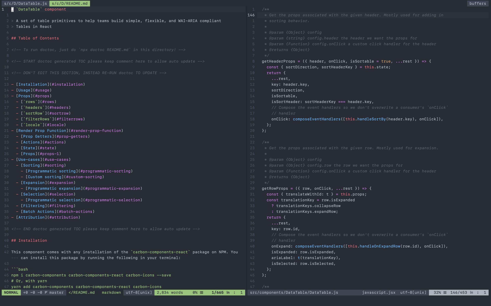

# NeoVim

My personal NeoVim directory. Plugins are added to the runtime path via [vim-pathogen](https://github.com/tpope/vim-pathogen).



## Installation

```bash
  mkdir ~/.config;
  git clone --recurse-submodules https://github.com/ian-henderson/nvim.git ~/.config/nvim;
```

Alternatively, you can install the submodules after doing a basic git clone into your nvim directory.

```bash
  mkdir ~/.config;
  git clone https://github.com/ian-henderson/nvim.git ~/.config/nvim;
  cd ~/.config/nvim;
  ./cli.sh bootstrap;
```

## Plugins

* [ale](https://github.com/w0rp/ale)
* [auto-pairs](https://github.com/jiangmiao/auto-pairs)
* [ctrlp](https://github.com/ctrlpvim/ctrlp.vim)
* [goyo.vim](https://github.com/junegunn/goyo.vim)
* [gruvbox](https://github.com/morhetz/gruvbox)
* [night-owl.vim](https://github.com/haishanh/night-owl.vim)
* [onedark.vim](https://github.com/joshdick/onedark.vim)
* [supertab](https://github.com/ervandew/supertab)
* [tender.vim](https://github.com/jacoborus/tender.vim)
* [vim-airline](https://github.com/vim-airline/vim-airline)
* [vim-airline-themes](https://github.com/vim-airline/vim-airline-themes)
* [vim-closetag](https://github.com/alvan/vim-closetag)
* [vim-fugitive](https://github.com/tpope/vim-fugitive)
* [vim-gitgutter](https://github.com/airblade/vim-gitgutter)
* [vim-graphql](https://github.com/jparise/vim-graphql)
* [vim-javascript](https://github.com/pangloss/vim-javascript)
* [vim-jsx](https://github.com/mxw/vim-jsx)
* [vim-monotone](https://github.com/Lokaltog/vim-monotone)
* [vim-sass-colors](https://github.com/shmargum/vim-sass-colors)
* [vim-sensible](https://github.com/tpope/vim-sensible)
* [vim-solarized8](https://github.com/lifepillar/vim-solarized8)
* [vim-startify](https://github.com/mhinz/vim-startify)
* [vim-vinegar](https://github.com/tpope/vim-vinegar)

### Plugin CLI

#### Adding one or more plugins

```bash
./cli.sh install [<plugin-git-url>...];
```

#### Listing plugins

```bash
./cli.sh list;
```

#### Removing one or more plugins

```bash
./cli.sh uninstall [<plugin>...];
```

#### Updating Plugins

```bash
# Update all plugins
./cli.sh update;

# Update specific plugins
./cli.sh update [<plugin>...];
```
